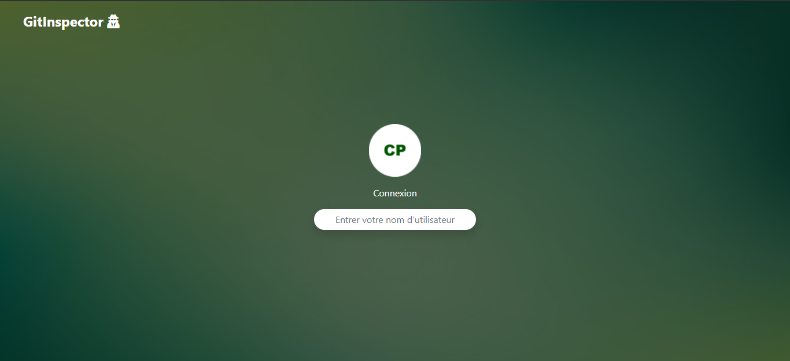
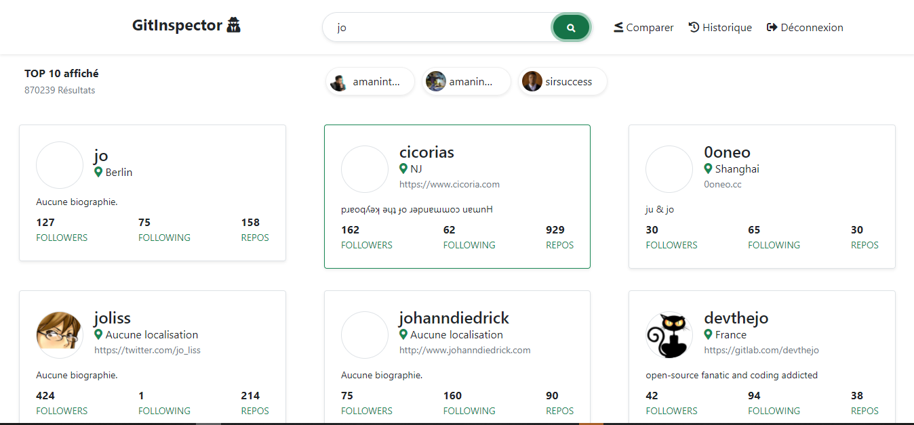
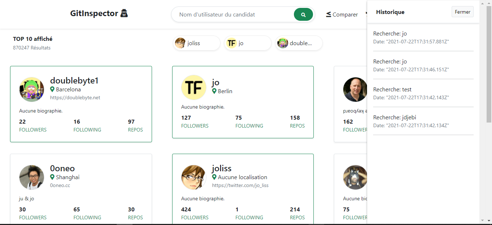
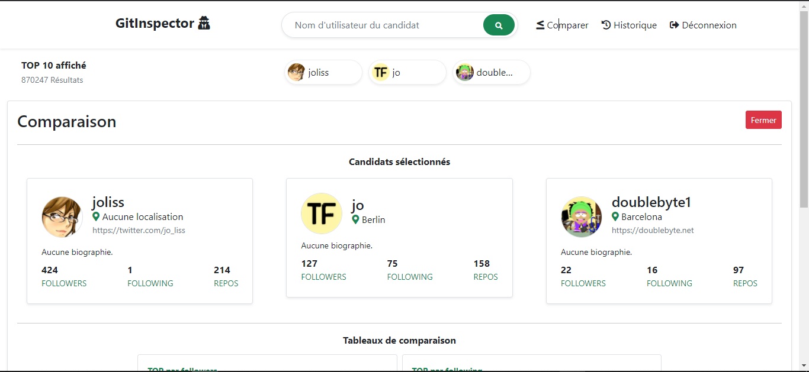
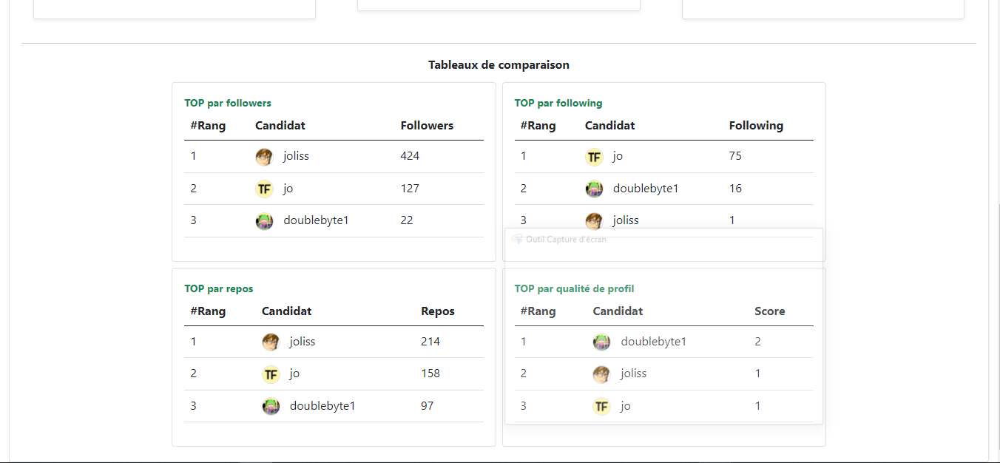

# Coding Interview Developer Frontend DRI - GitInspector

Ce dépôt Github contient les sources des problèmes de Frontend imposé par la DRI de CinetPay. L'application obtenue suite à nos travaux; que nous avons nommé **GitInspector**; tente de répondre aux exigences des problèmes par la proposition des fonctionnalités suivantes:

- Connexion avec timeout total de 30 secondes
- Recherche du profil Github d'un candidat
- Module de comparaison des profils basée sur une évaluation des données fournies par l'API Github

Ce readme représente à la fois le guide d'installation et le manuel d'utilisation de l'application et suivra le plan suivant:

- [Parlons technique](#parlons-technique)
    - [Outils de développement](#outils-de-développement)
    - [Modèle d'optimisation](#modèle-d'optimisation)
    - [L'API Github](#l'api-github)
- [Installation](#installation)
- [Manuel d'utilisation](#manuel-d'utilisation)
    - [Connexion](#connexion)
    - [Rechercher un candidat](#rechercher-un-candidat)
    - [Historique de recherche](#historique-de-recherche)
    - [Comparaison des candidats](#comparaison-des-candidats)
    - [Guide de modification de la charte graphique](#guide-de-modification-de-la-charte-graphique) 
- [En cas de problème](#en-cas-de-probleme) 

## Parlons technique

### Outils de développement

Pour donner vie à ce projet, nous avons opté pour Vue.js en raison de la forte expérience que nous avec lui. Ci-dessous la liste des outils supplémentaires que nous avons utilisés.

- Bootstrap 5.0.2, comme fondation de notre IHM
- FontAwesome 5, pour les icônes de l'interface

### Modèle d'optimisation

Après analyse des problèmes, nous avons déduit que le Frontend ne sera pas soumis à une forte charge de travail. Ce constat nous a amené a utiliser des algorithmes de Frontend pour les calculs de rendus tel que le **tri bulle** qui est intuitive pour les ordonnancements de petits volumes de données. L'idée de cette approche est d'optimiser le rendu de la page et de réduire les ressources utilisées.

### L'API Github

Il s'agit d'un point à lire attentivement. Pour rechercher les profils des candidats sur Github nous avons utilisé les endpoints suivants: `GET /search/users?q=:q&per_page=10&page=1` et `GET /search/users/:login`. Remarquons que nous avons volontairement réduit le nombre de candidats à 10. En effet, dans le cadre de l'interview, nous avons réduit ce nombre, pour réduire les appels d'API, car nous sommes limités en nombre d'appels par heure. Étant donné que l'affichage des candidats nécessite `1 + nombre_de_resultats` d'appels d'API. Il est donc possible de finir notre quota d'appel un seul appel. C'est pourquoi nous avons opté pour 10 candidats par appel. Nous avons utilisons notre Github "personal access token" pour étendre le nombre d'appels. Ainsi, vous devez faire même pour pouvoir utiliser l'application. Voir [https://github.com/jdjebi/GitInpector#en-cas-de-problème](https://github.com/jdjebi/GitInpector#en-cas-de-problème). 

## Installation

Dans votre terminal, taper les commandes suivantes:

```
git clone https://github.com/jdjebi/GitInspector.git // Téléchargement du projet sur votre machine

cd GitInspector/

npm install // Installation des dépendances

npm run serve // Lancement de l'application 
```

En principe l'application se lancera à l'adresse suivante sinon consultez les logs de la dernière commande pour voir l'adresse: [http://localhost:8080/](http://localhost:8080/).

## Manuel d'utilisation

### Connexion

Lorsque vous accédez à l'adresse de l'application, l'interface ci-dessous s'affichera:



Il s'agit de la page de connexion. Suivez simplement  le protocole de connexion qui se fait en deux étapes de 15 secondes de post-traitement chacune (donc un total de 30 secondes). Effectuer ensuite le protocole de connexion en suivant les étapes suivantes:

1. Entrer un identifiant quelconque, puis valider avec la touche entrée
2. Entrer un mot de passe quelconque, puis valider avec la touche entrée

Après avoir validé votre mot de passe, vous serez redirigé vers la page de recherche.

### Rechercher un candidat

Pour rechercher un candidat, entrer son nom dans le champ de recherche, puis valider. Vous verrez s'affiche la liste des 10 meilleurs résultats avec la nombre total de résultat juste au-dessus:



Lorsque vous cliquez sur une carte d'un candidat, cette dernière garde une surbrillance de bordure verte, et vous observerez en dessous de la zone de recherche une bulle représentant le candidat, indiquant qu'il a été sélectionné. Vous ne pouvez sélectionner que trois candidats. Si vous sélectionnez un autre candidat, la bulle du candidat la plus ancienne disparaitra pour permettre à la nouvelle de s'afficher au tout début des bulles. 

### Historique de recherche

Toutes les recherches effectuées sont enregistrées dans un historique, qui est accessible en cliquant sur le lien historique dans la barre de navigation.



### Comparaison des candidats

Lorsque vous sélectionnez au moins deux candidats, vous avez accès au module de comparaison. Ce module expose clairement les candidats sélectionnés côte à côte et génère quatre tableaux classant les candidats selon différents critiques pour affiner la comparaison des profils. 



Les tableaux de comparaison sont les suivants:

- Tableau du TOP par followers: Classement des candidats en fonction de leur nombre de followers
- Tableau du TOP par following: Classement des candidats en fonction de leur nombre de profils Github suivi
- Tableau du TOP par repos: Classement des candidats en fonction de leur nombre de repository public
- Tableau du TOP par qualité de profil: Classement des candidats par qualité de profil

   

## Guide de modification de la charte graphique

Le tableau ci-dessous présente les caractéristiques visuelles de l'interface de GitInspector.

| Composant                | Style                                                                            |
|--------------------------|----------------------------------------------------------------------------------|
| Couleur principale       | #198754 (Vert)                                                                   |
| Couleur de fond          | blanc                                                                            |
| Couleur de base du texte | noire                                                                            |
| Taille de base du texte  | Taille de bootstrap par défaut                                                   |
| Contenu secondaire       | Petite/moyenne taille et/ou couleur grise/verte                                  |
| Contenu important        | Moyenne/grande taille et/ou couleur noire/verte, texte gras                      |
| Police                   | Police de bootstrap par défaut                                                   |
| Boutons                  | Bouton (bootstrap) vert et rouge uniquement                                      |
| Carte candidat           | Bordure(grise), ombre(gris léger), bordure arrondie, survole(surbrillance verte) |
| Photo candidat           | Totalement arrondie                                                              |
| Bulle candidat           | Semi-arrondie                                                                    |
| Champ                    | Bordure grise, fond blanc, ombre légère                                          |

Pour mettre à jour la direction visuelle, il faudra suivre les étapes suivantes:

1. Identifier les composants concernés
2. Opérer les modifications voulues
3. Vérifier l'harmonie des modifications avec l'ensemble des autres composants
4. S'assurer de versionner les nouveaux styles

## En cas de problème

Le problème le plus probable de se produire est le non fonctionnement de l'API Github en raison de l'expiration ou de l'invalidité de notre access token. Dans ce cas, nous vous prions d'utiliser votre access token, que vous pouvez trouver ici [https://github.com/settings/tokens](https://github.com/settings/tokens).  Pour que votre access token soit pris en compte par GitInspector, vous devez modifier la ligne `var access_token = "ACCESS_TOKEN";` du fichier `views\RechercheCandidat.vue`.